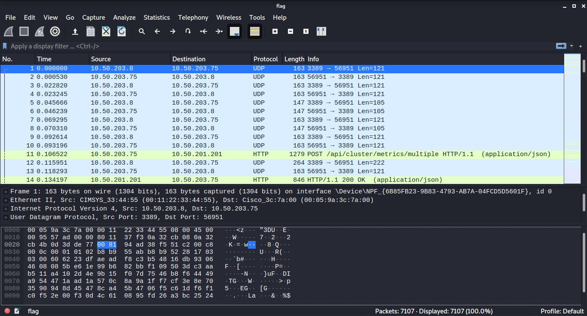
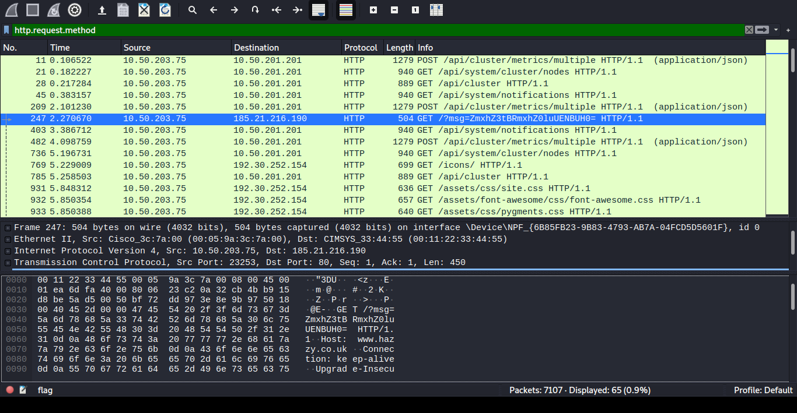

# A CAPture of a flag
From [CTFlearn](https://ctflearn.com/challenge/356)

This challenge gives a file without extension which contains a flag.

Running file on flag, we get that is a Wireshark capture: 

```bash $ file flag

flag: pcapng capture file - version 1.0

```

When wireshark `$ wireshark flag` is open  we see a lot of packets.




After some time looking around there is a GET that stands out:




This GET method has a query parameter 'msg' encoded in base64, decoding it give us the flag.

```bash
$ echo "ZmxhZ3tBRmxhZ0luUENBUH0=" | base64 -d

flag{AFlagInPCAP}

```
